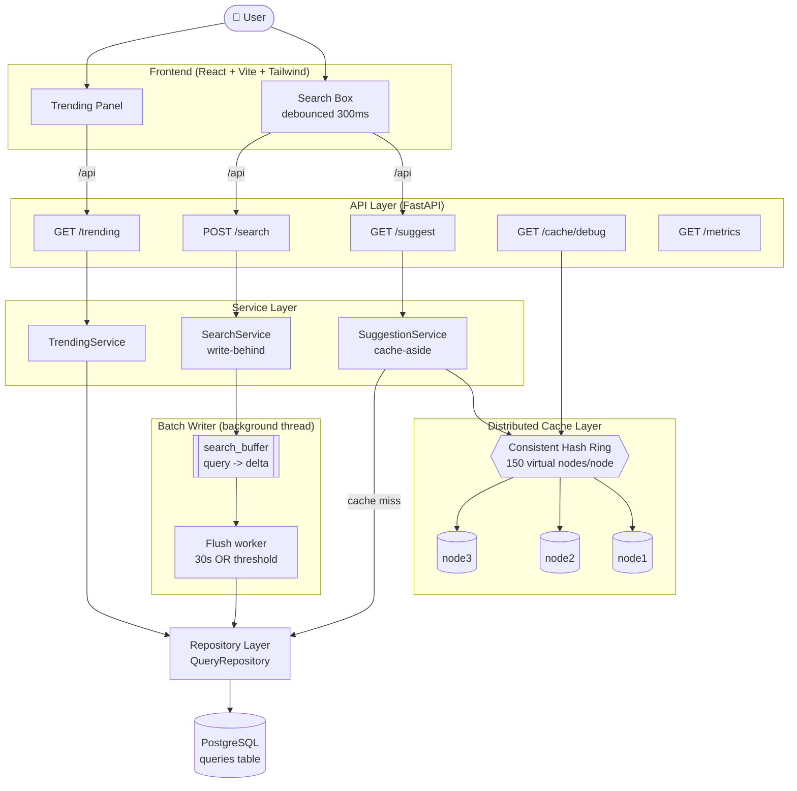

# High-Level Design — Search Typeahead System

## Component Diagram

## Data flow summary

| Path | Hot path? | Touches DB? |
|------|-----------|-------------|
| `GET /suggest` (cache hit) | yes | no |
| `GET /suggest` (cache miss) | yes | read |
| `POST /search` | yes | no (buffered) |
| Batch flush (every 30s / threshold) | background | batched write |
| `GET /trending` | warm | read |
| `GET /cache/debug` | cold | no |

## Key design points

- **Cache-aside** on the read path keeps popular prefixes out of the database.
- **Consistent hashing** routes each prefix to a stable cache node and limits
  key movement when the cache topology changes.
- **Write-behind batching** removes the database from the `POST /search` hot
  path, collapsing many increments into a few upserts.
- **Clean layering** (API → Service → Repository → DB) keeps business logic
  independent of transport and storage details.
