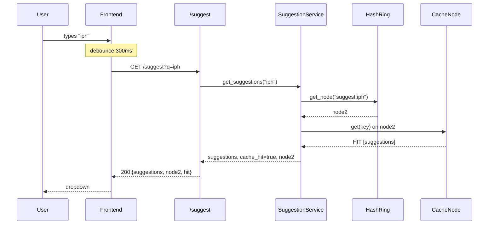
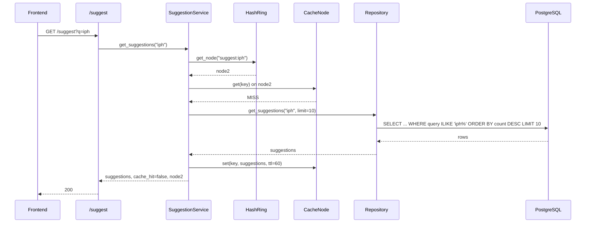
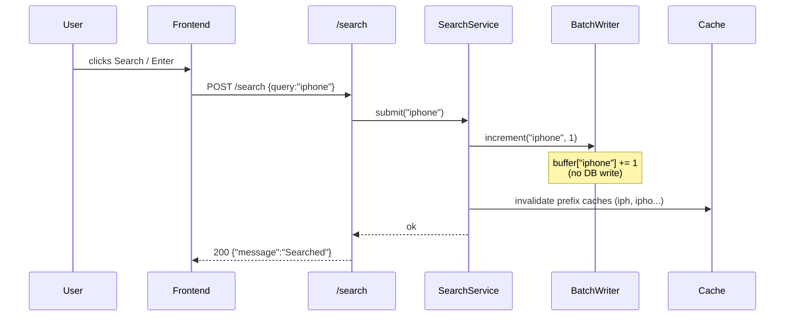
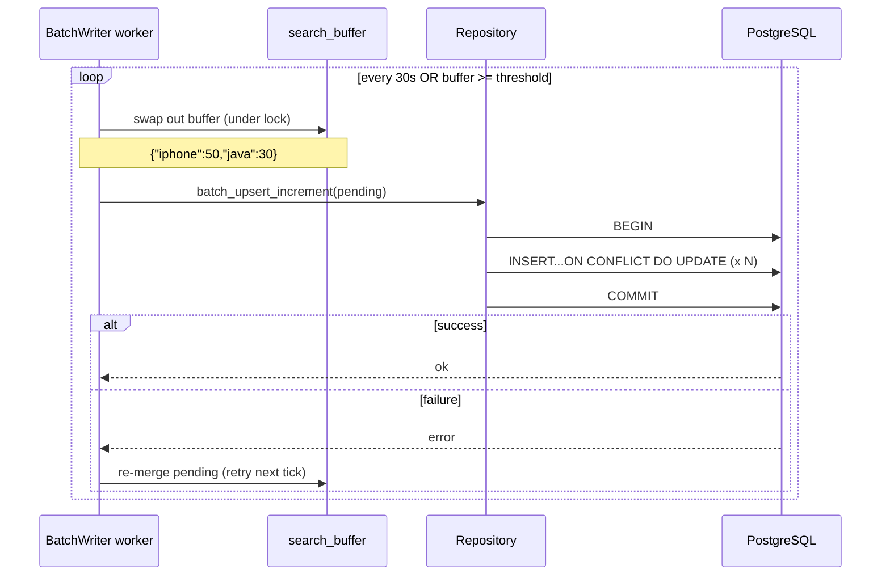
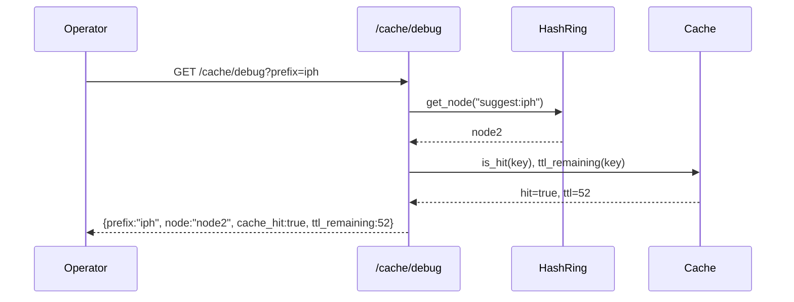

# Sequence Diagrams

## 1. Suggestion request — cache hit

```mermaid
sequenceDiagram
    participant U as User
    participant FE as Frontend
    participant API as /suggest
    participant S as SuggestionService
    participant R as HashRing
    participant C as CacheNode
    U->>FE: types "iph"
    Note over FE: debounce 300ms
    FE->>API: GET /suggest?q=iph
    API->>S: get_suggestions("iph")
    S->>R: get_node("suggest:iph")
    R-->>S: node2
    S->>C: get(key) on node2
    C-->>S: HIT [suggestions]
    S-->>API: suggestions, cache_hit=true, node2
    API-->>FE: 200 {suggestions, node2, hit}
    FE-->>U: dropdown
```

## 2. Suggestion request — cache miss

```mermaid
sequenceDiagram
    participant FE as Frontend
    participant API as /suggest
    participant S as SuggestionService
    participant R as HashRing
    participant C as CacheNode
    participant Repo as Repository
    participant DB as PostgreSQL
    FE->>API: GET /suggest?q=iph
    API->>S: get_suggestions("iph")
    S->>R: get_node("suggest:iph")
    R-->>S: node2
    S->>C: get(key) on node2
    C-->>S: MISS
    S->>Repo: get_suggestions("iph", limit=10)
    Repo->>DB: SELECT ... WHERE query ILIKE 'iph%' ORDER BY count DESC LIMIT 10
    DB-->>Repo: rows
    Repo-->>S: suggestions
    S->>C: set(key, suggestions, ttl=60)
    S-->>API: suggestions, cache_hit=false, node2
    API-->>FE: 200
```

## 3. Search submission

```mermaid
sequenceDiagram
    participant U as User
    participant FE as Frontend
    participant API as /search
    participant SS as SearchService
    participant BW as BatchWriter
    participant C as Cache
    U->>FE: clicks Search / Enter
    FE->>API: POST /search {query:"iphone"}
    API->>SS: submit("iphone")
    SS->>BW: increment("iphone", 1)
    Note over BW: buffer["iphone"] += 1<br/>(no DB write)
    SS->>C: invalidate prefix caches (iph, ipho...)
    SS-->>API: ok
    API-->>FE: 200 {"message":"Searched"}
```

## 4. Batch flush

```mermaid
sequenceDiagram
    participant BW as BatchWriter worker
    participant Buf as search_buffer
    participant Repo as Repository
    participant DB as PostgreSQL
    loop every 30s OR buffer >= threshold
        BW->>Buf: swap out buffer (under lock)
        Note over BW,Buf: {"iphone":50,"java":30}
        BW->>Repo: batch_upsert_increment(pending)
        Repo->>DB: BEGIN
        Repo->>DB: INSERT...ON CONFLICT DO UPDATE (x N)
        Repo->>DB: COMMIT
        alt success
            DB-->>BW: ok
        else failure
            DB-->>BW: error
            BW->>Buf: re-merge pending (retry next tick)
        end
    end
```

## 5. Cache debug

```mermaid
sequenceDiagram
    participant Dev as Operator
    participant API as /cache/debug
    participant R as HashRing
    participant C as Cache
    Dev->>API: GET /cache/debug?prefix=iph
    API->>R: get_node("suggest:iph")
    R-->>API: node2
    API->>C: is_hit(key), ttl_remaining(key)
    C-->>API: hit=true, ttl=52
    API-->>Dev: {prefix:"iph", node:"node2", cache_hit:true, ttl_remaining:52}
```
